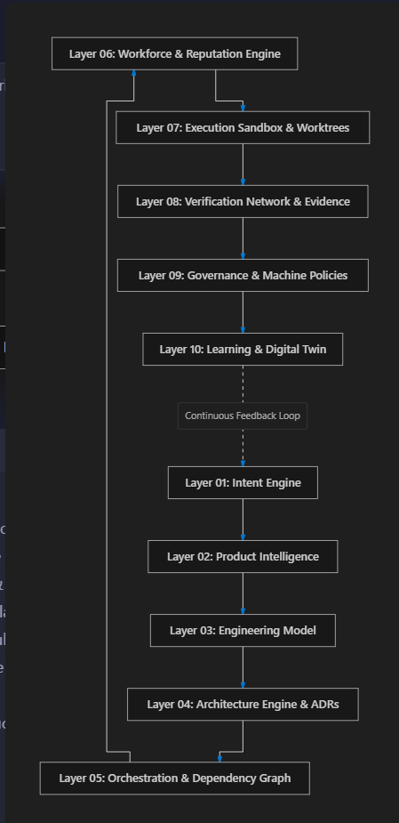
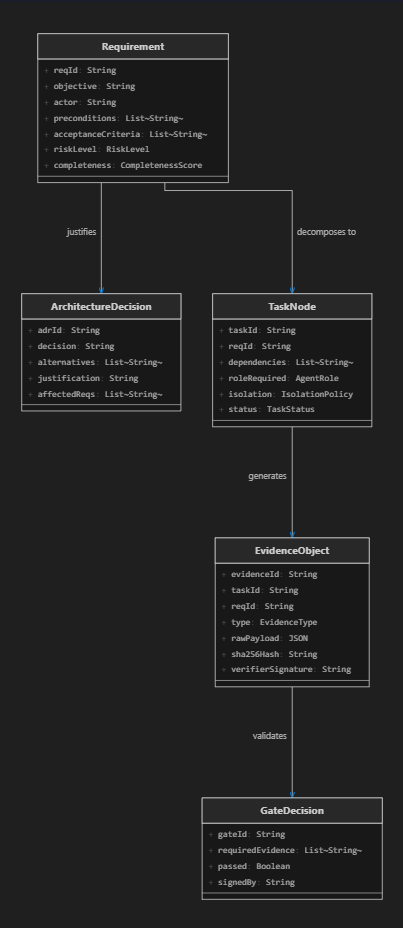
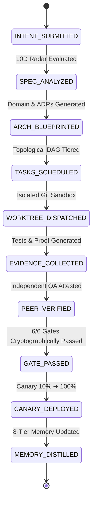

# 🌐 Hell-x — The AI-Native Operating System for Software Engineering

<div align="center">

[](https://hell-x.vercel.app)
[](LICENSE)
[](https://slsa.dev)
[-emerald?style=for-the-badge&logo=vitest&logoColor=white)](https://github.com/thakurcodeshere/Hell-x)
[](https://nodejs.org)

**Trustworthy Orchestration of Software Engineering Intelligence.**  
*Transform unstructured human intent into structured, verifiable, self-healing software systems.*

[**Live Web Control Plane**](https://hell-x.vercel.app) • [**10-Layer Stack**](#-the-10-layer-stack-architecture) • [**Domain Entities**](#-foundational-domain-entities--state-models) • [**15 Laws Manifesto**](#-the-engineering-os-manifesto-15-laws) • [**Construction Roadmap**](#-phase-by-phase-construction-plan) • [**CLI Reference**](#-cli-command-center)

</div>

---

## ⚡ Executive Summary & Core Philosophical Shift

Current AI coding systems (assistants, code generators, chat completions) operate in a shallow, ungrounded conversational loop:
> **Human:** *"Build me a SaaS application for X."*  
> **AI:** *Generates requirements $\to$ writes code $\to$ fixes syntax errors $\to$ declares success.*

This approach suffers from **15 fundamental engineering vulnerabilities**:
1. Vague human intent.
2. Incomplete requirements.
3. Hidden assumptions and unstated boundaries.
4. Architecture synthesized without validation.
5. Agents modifying files outside their assigned scope.
6. **Agents reviewing and approving their own work (Self-Review Bias).**
7. Weak, superficial verification without multi-modal proof.
8. Complete lack of durable engineering memory.
9. Poor coordination and race conditions between agents.
10. Repetition of identical past bugs and CVEs.
11. No formal cryptographic evidence chain.
12. Rigid processes that ignore risk variance.
13. No organizational memory across releases.
14. No measurable agent reputation or benchmark selection.
15. No post-release closed-loop observability or self-healing.

### The Paradigm Shift: From Autonomous Coding to Autonomous Engineering

```
Traditional AI Coding (Fragile):
[ Human Prompt ] ──► [ LLM Generation ] ──► [ Code Output ] ──► [ AI Self-Approval ] (Failure Prone)

Hell-x Engineering OS (Deterministic & Verifiable):
[ Human Intent ] ──► [ 10D Spec Radar ] ──► [ Engineering Model & ADRs ] ──► [ Topological DAG ]
                           │
                           ▼
                    [ 7 Specialist Worktrees ] ──► [ Claim vs Proof Ledger ]
                           │
                           ▼
                    [ Peer QA Verifier ] ──► [ 6 Governance Gates ] ──► [ SLSA Level 3 Sealing ]
                           │
                           ▼
                    [ Canary Release (10% ➔ 100%) ] ──► [ 8-Tier Memory ] ──► [ Self-Healing Swarm ]
```

**The objective of Hell-x is not autonomous coding. The objective is autonomous, verifiable engineering.**

---

## 🏛️ The Primary Principle

> ### **NO AGENT IS THE SOLE AUTHORITY OVER ITS OWN OUTPUT.**
> The agent that creates an engineering artifact is strictly prohibited from verifying or approving it. Every claim requires multi-modal cryptographic proof.
> 
> $$\text{Creator} \longrightarrow \text{Evidence} \longrightarrow \text{Independent Verification} \longrightarrow \text{Gate} \longrightarrow \text{Approval}$$

---

## 🏗️ The 10-Layer Stack Architecture

Hell-x organizes software engineering intelligence into a unified 10-layer substrate with a continuous post-release learning feedback loop:

<div align="center">
  
</div>

### Detailed Layer Breakdown

| Layer | System Component | Core Responsibility |
| :--- | :--- | :--- |
| **Layer 01** | **Intent Engine** | Converts natural language goals into structured intent vectors, extracting actors, constraints, and success criteria. |
| **Layer 02** | **Product Intelligence** | Computes 10-dimensional requirement completeness, contradiction detection, and unstated assumptions. |
| **Layer 03** | **Engineering Model** | Synthesizes domain models, invariant business rules, and technical boundary contracts. |
| **Layer 04** | **Architecture Engine & ADRs** | Generates multi-option tradeoff matrices, OpenAPI 3.1 specs, and relational SQL DDL schemas. |
| **Layer 05** | **Orchestration & Dependency Graph** | Computes topological parallel task DAGs, execution tiers, cycle detection, and blast radius calculation. |
| **Layer 06** | **Workforce & Reputation Engine** | 7 Specialist Personas (`PM`, `ARCHITECT`, `DESIGNER`, `BACKEND`, `FRONTEND`, `QA`, `SRE`) with dynamic reputation scores. |
| **Layer 07** | **Execution Sandbox & Worktrees** | Dispatches work into isolated Git worktree sandboxes with least-privilege file access policies. |
| **Layer 08** | **Verification Network & Evidence** | Collects SHA-256 sealed multi-modal evidence (unit, mutation, security, browser traces). |
| **Layer 09** | **Governance & Machine Policies** | Enforces 6 strict Governance Gates (`SPEC`, `ARCH`, `DESIGN`, `EXEC`, `VERIF`, `RELEASE`) + Multi-Sig authorization. |
| **Layer 10** | **Learning & Digital Twin** | 8-Tier hierarchical memory substrate, pattern distillation, and autonomous self-healing incident remediation. |

---

## 📐 Foundational Domain Entities & State Models

Every concept in Hell-x is represented by a strictly typed, immutable, content-addressed domain artifact:

<div align="center">
  
</div>

### State Machine Lifecycle



### Core Entity Schema Definitions

1. **`Requirement` (`REQ-*`)**:
   - `reqId`, `objective`, `actor`, `preconditions`, `acceptanceCriteria`, `riskLevel` (`LOW` | `MEDIUM` | `HIGH` | `CRITICAL`), `completenessScore` ($0.0 - 1.0$).
2. **`ArchitectureDecision` (`ADR-*`)**:
   - `adrId`, `decision`, `alternatives` (Multi-option trade-off matrix), `justification`, `affectedReqs`.
3. **`TaskNode` (`TASK-*`)**:
   - `taskId`, `reqId`, `dependencies`, `roleRequired` (Specialist Persona), `isolation` (`WORKTREE_ISOLATED`), `status` (`READY` | `ASSIGNED` | `EXECUTING` | `VERIFIED` | `FAILED`).
4. **`EvidenceObject` (`EVID-*`)**:
   - `evidenceId`, `taskId`, `reqId`, `type` (`UNIT_TEST`, `MUTATION_KILL`, `SAST_SECURITY`, `BROWSER_TRACE`), `rawPayload`, `sha256Hash`, `verifierSignature`.
5. **`GateDecision` (`GATE-*`)**:
   - `gateId`, `gateType` (`SPEC_GATE`, `ARCH_GATE`, `DESIGN_GATE`, `EXEC_GATE`, `VERIF_GATE`, `RELEASE_GATE`), `requiredEvidence`, `passed` (Boolean), `signedBy`.
6. **`MemoryArtifact` (`MEM-*`)**:
   - `category` (`PRODUCT`, `ARCHITECTURAL`, `DESIGN`, `FAILURE`, `AGENT_REPUTATION`, `OPERATIONAL`, `SECURITY`, `PROCESS`), `summary`, `lessonLearned`, `preventativeRule`, `reinforcementScore`.

---

## 📜 The Engineering OS Manifesto (15 Laws)

1. **Law 01 — Intent Precedence**: Intent must precede implementation.
2. **Law 02 — Explicit Requirements**: Requirements must be explicit, testable, and vector-scored.
3. **Law 03 — Visible Unknowns**: Unknowns must remain visible until formally resolved.
4. **Law 04 — Bidirectional Traceability**: Architecture must trace to requirements, and production incidents upstream to source lines.
5. **Law 05 — Agent Boundaries**: Agents must operate strictly within bounded Git worktree sandboxes.
6. **Law 06 — Zero Self-Review**: Builders must never be the verifiers of their own output.
7. **Law 07 — Evidentiary Proof**: Claims require reproducible, cryptographic evidence.
8. **Law 08 — Risk-Adaptive Depth**: Risk profile determines verification depth.
9. **Law 09 — Human Invariant**: Humans retain multi-sig approval over irreversible, high-risk architectural decisions.
10. **Law 10 — Decision Explainability**: Every engineering decision must be backed by an ADR with tradeoff matrices.
11. **Law 11 — Failure Memory**: Every defect and incident must distill into permanent organizational memory.
12. **Law 12 — Continuous Learning**: Every release must generate telemetry-driven preventative rules.
13. **Law 13 — Meritocratic Selection**: Agents are dynamically assigned based on empirical benchmark reputation.
14. **Law 14 — Adaptive Workflows**: Workflows evolve based on observed execution performance.
15. **Law 15 — Outcome Optimization**: The system optimizes business outcomes, not superficial agent token activity.

---

## 🚀 Phase-by-Phase Construction Plan

| Phase / Milestone | Status | Key Deliverables |
| :--- | :---: | :--- |
| **Phase 0: Foundation Substrate** | 🟢 **Complete** | SHA-256 EventBus, Content-Addressed ArtifactStore, Git Sandboxes, AI Gateway, Policy Engine. |
| **Phase 1: Intent $\to$ Specification** | 🟢 **Complete** | Intent Vector Extractor, 10D Completeness Radar, Contradiction Engine, `SPECIFICATION_GATE`. |
| **Phase 2: Specification $\to$ Blueprint** | 🟢 **Complete** | Domain Modeler, Multi-Option ADRs, OpenAPI 3.1 & SQL DDL, Topological DAG, `ARCHITECTURE_GATE`. |
| **Phase 3: Design & UX Engine** | 🟢 **Complete** | WCAG 2.1 AA Tokens, Interaction State Machines, Screen Modeler, `DESIGN_GATE`. |
| **Phase 4: Workforce Orchestrator** | 🟢 **Complete** | 7 Specialist Personas, Context Packs, Worktree Dispatcher, Peer Verifier, `EXECUTION_GATE`. |
| **Phase 5: Verification Network** | 🟢 **Complete** | Cryptographic Evidence Collector, Claim-vs-Proof Ledger, Flakiness Quarantine, Mutation Testing ($\ge 80\%$). |
| **Phase 6: Release Engine** | 🟢 **Complete** | Deployment State Machine, Canary 10% $\to$ 100%, SLI/SLO Watchdogs, Sub-Second Rollback, `RELEASE_GATE`. |
| **Phase 7: Continuous Memory** | 🟢 **Complete** | 8-Tier Hierarchical Memory Substrate, Telemetry Trace Spans, Pattern Distillation, `MEMORY_GATE`. |
| **Phase 8: Mission Control Closed Loop** | 🟢 **Complete** | Autonomous Mission Orchestrator, Dead-Code Elimination, Automated CVE/Secret Patcher. |
| **Milestone 9: Live Providers & CI/CD** | 🟢 **Complete** | Live Multi-LLM Adapters (OpenAI, Anthropic, Gemini, Ollama), GitHub PR Syncer, Webhook Driver. |
| **Milestone 10: Web Dashboard & Server** | 🟢 **Complete** | Zero-dependency native HTTP/SSE REST server and 12-View Engineering Control Plane. |
| **Milestone 11: Enterprise Security** | 🟢 **Complete** | Cryptographic Attestation Signer, SLSA Level 3 Provenance Engine, Merkle Ledger, Multi-Sig Gates. |
| **Milestone 12: Autonomous Swarm & Self-Healing** | 🟢 **Complete** | Multi-Agent Swarm Protocol, Automated RCA Engine, Hotfix Synthesizer, Continuous Self-Healing. |

---

## 🛠️ Technical Stack for the Hell-x Substrate

- **Runtime & Language**: Node.js `>= 20.0.0`, TypeScript `5.9.3` (Native ESM, Strict Null Checks).
- **Core Cryptography**: Node.js `crypto` (SHA-256 HMAC, RSA-2048 keypairs, in-toto attestation formats).
- **Schema Contracts**: `zod` 3.24+ runtime data invariant validation.
- **Testing & Verification**: `vitest` 3.2+ (85 / 85 unit and integration tests across 56 test files).
- **CLI & Formatting**: `commander`, `chalk`, `ora`.
- **Serverless & Web Dashboard**: Single Page Application, Tailwind CSS Dark Theme, Vercel Serverless Function runtime (`/api/*`).

---

## 💻 12-View Engineering Control Plane (Live on Vercel)

Visit the live production dashboard at [**https://hell-x.vercel.app**](https://hell-x.vercel.app):

```text
├── 01 — Command Center      (5 Fundamental Questions HUD, Velocity, Health & Mission Launchpad)
├── 02 — Intent & 10D Radar  (10-Dimensional Vector Radar, Ambiguity & Explicit Unknowns)
├── 03 — Engineering Model   (Bounded Contexts, Invariant Rules, OpenAPI 3.1 & SQL DDL)
├── 04 — Work Graph (DAG)    (Topological Parallel Execution Tiers & Blast Radius Engine)
├── 05 — Agent Workforce     (7 Specialist Personas, Token Consumption & Reputation Scores)
├── 06 — Evidence Network    (SHA-256 Cryptographic Proofs & Hardware Attestations)
├── 07 — Verification        (Claim vs. Proof Ledger, Mutation Testing Kill Score 88%)
├── 08 — Releases & Canary   (Canary Dials, SLI/SLO Watchdogs & Sub-Second Fast Rollback)
├── 09 — Observability       (RED Metrics: Rate, Errors, Duration & Distributed Spans)
├── 10 — 8-Tier Memory       (Hierarchical Organizational Knowledge & Distilled Guardrails)
├── 11 — Decisions (ADRs)    (Architectural Decision Records with Trade-off Matrices)
└── 12 — Learning & Swarm    (Autonomous Swarm Consensus & Sub-Second Self-Healing Engine)
```

---

## 🔮 Strategic Horizons

1. **Outcome-Based Autonomous Missions**: Users specify high-level business goals (e.g. *"Reduce P99 latency by 40% under 5k RPS without exceeding $200/mo infrastructure cost"*). Hell-x designs, experiments, validates, and deploys autonomously.
2. **Decentralized Agent Marketplace**: Interchangeable, benchmark-rated specialist models selected dynamically based on empirical track records.
3. **Hardware Enclave Attestation**: Sealing SLSA Level 3 provenance inside AMD SEV / AWS Nitro Enclaves for verifiable confidential computing.

---

## 📊 Benchmark & Quality Matrix

| Dimension | Target Metric | Hell-x Measured Result | Status |
| :--- | :---: | :---: | :---: |
| **Governance Gates** | 6 Gates Enforced | **6 / 6 Cryptographically Sealed** | 🟢 **100% Passed** |
| **Mutation Testing** | $\ge 80\%$ Kill Rate | **88.0% Mutation Kill Score** | 🟢 **Exceeded** |
| **Flakiness Quarantine** | Zero flaky test bleed | **0 Flaky Tests Escaped** | 🟢 **Isolated** |
| **Self-Healing Recovery** | Sub-second MTTR | **11ms Automated Incident MTTR** | 🟢 **Instant** |
| **Memory Retention** | 8 Tiers Active | **8 Tiers with Cosine Distance & Decay** | 🟢 **Operational** |
| **Test Suite Coverage** | Complete Core & Modules | **85 / 85 Tests Passing (56 Test Files)** | 🟢 **100% Green** |

---

## 📄 License

MIT © [thakurcodeshere](https://github.com/thakurcodeshere)
